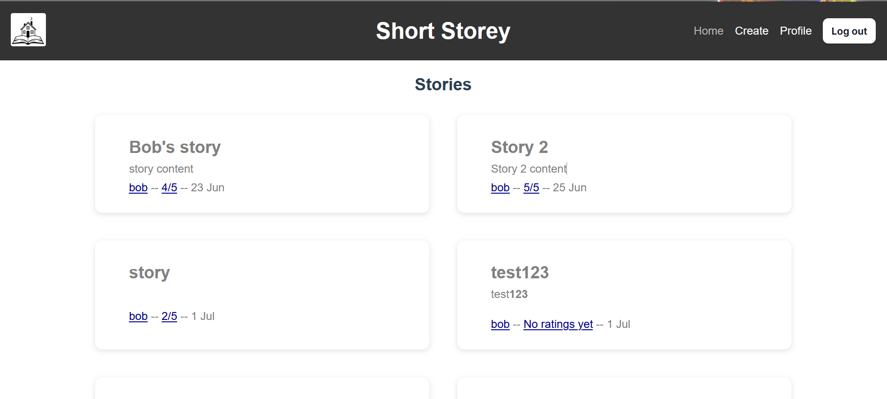

# 🏠 Shortstorey

Full **CRUD** project for reading and sharing short stories.

Backend includes a database and api to store users, stories and ratings

Frontend fetches and presents this data in a user friendly manner

## Tech stack

### Frontend

- Vue + JS
- SCSS
- lint
- pinia (for state storage / handling auth tokens)

### Backend

- Typescript
- Prisma
- Jest
- Fastify
- bcrypt (for password hashing)
- jwt (for token generation)

**Rating's are updated based on user "rating" making them dynamic and updates requiring propagating.**
